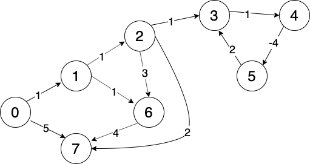

# Bellman-Ford Algorithm

This project demonstrates a sample implementation of the Bellman-Ford algorithm.

The algorithm takes in a graph and a start vertex and returns an array of all shortest paths from the given start vertex. The algorithm also detects negative cycles. Distances to vertices which are part of a negative cycle will be marked as ``-Infinity``.

A graph internally is represented as an adjacency list where the index of the list itself is a list of edges where each edge contains ``head`` and ``tail`` vertices and a ``cost``.

``app.py`` creates the following demo graph and runs the Bellman-Ford algorithm on it.

 

The output for this demo graph is:

```
The cost to get from node  0 to  0 is:  0.00
The cost to get from node  0 to  1 is:  1.00
The cost to get from node  0 to  2 is:  2.00
The cost to get from node  0 to  3 is:  -inf
The cost to get from node  0 to  4 is:  -inf
The cost to get from node  0 to  5 is:  -inf
The cost to get from node  0 to  6 is:  2.00
The cost to get from node  0 to  7 is:  4.00
```